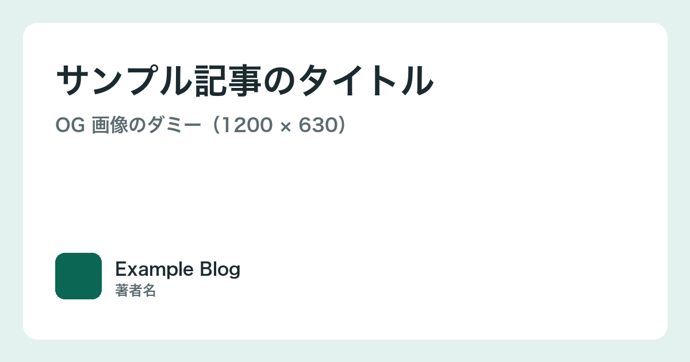
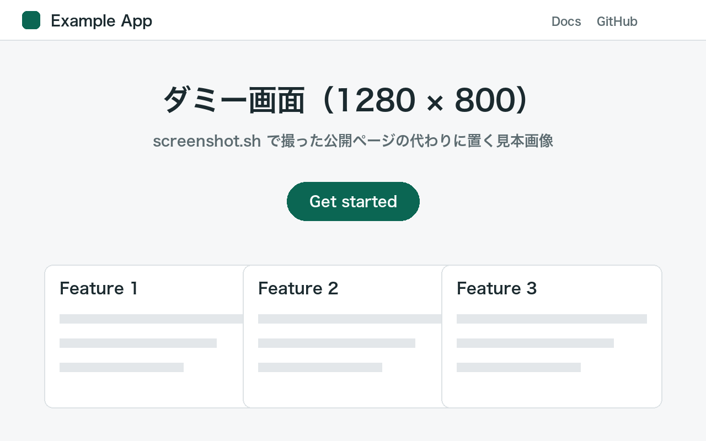

<!-- _class: ivory title -->

# キャッシュ無効化は「いつ」ではなく「誰が」で決める

Repository 層に書き手を一本化して不整合バグをゼロにした話

<div class="meta"><strong>山田 太郎</strong><span>Backend Engineer</span><span>Kaigi on Something 2026</span></div>

<!--
表紙。イベント名と日付は当日の情報に合わせる。
-->

---

<!-- _class: ivory section -->

<div class="num">01</div>

# なぜキャッシュの不整合は消えなかったのか

3 つの原因を、障害の時系列から振り返る

---

# 今日持ち帰ってほしいこと

キャッシュの書き手を 1 箇所に絞れば、無効化のタイミング問題はほぼ消える

<div class="rows">
  <div class="row"><div class="num">1</div><div><h3>不整合の原因はタイミングではなく「書き手の数」</h3><p>14 箇所から invalidate() を呼んでいた。誰も全体を把握していなかった</p></div></div>
  <div class="row"><div class="num">2</div><div><h3>Repository を唯一の書き手にする</h3><p>DB 更新とキャッシュ無効化を同じメソッドで行う。呼び出し側は何も知らなくてよい</p></div></div>
  <div class="row"><div class="num">3</div><div><h3>移行は 3 週間、段階的に</h3><p>読み取りパスは触らず、書き込みパスだけを順に寄せた</p></div></div>
</div>

---

# 3 つの原因

いずれも「無効化を誰が呼ぶか」が決まっていないことに帰着する

<div class="cols cols-3">
  <div class="card"><div class="icon"><svg xmlns="http://www.w3.org/2000/svg" width="24" height="24" viewBox="0 0 24 24" fill="none" stroke="currentColor" stroke-width="2" stroke-linecap="round" stroke-linejoin="round"><path d="M15 6a9 9 0 0 0-9 9V3"/><circle cx="18" cy="6" r="3"/><circle cx="6" cy="18" r="3"/></svg></div><h3>書き手が分散</h3><p>Controller、Job、管理画面の 3 系統がそれぞれ DB を更新していた</p></div>
  <div class="card"><div class="icon"><svg xmlns="http://www.w3.org/2000/svg" width="24" height="24" viewBox="0 0 24 24" fill="none" stroke="currentColor" stroke-width="2" stroke-linecap="round" stroke-linejoin="round"><circle cx="12" cy="12" r="10"/><path d="M12 6v6l4 2"/></svg></div><h3>TTL に頼っていた</h3><p>「5 分待てば直る」が暗黙の運用になり、根本対策が後回しに</p></div>
  <div class="card"><div class="icon"><svg xmlns="http://www.w3.org/2000/svg" width="24" height="24" viewBox="0 0 24 24" fill="none" stroke="currentColor" stroke-width="2" stroke-linecap="round" stroke-linejoin="round"><path d="m21 21-4.34-4.34"/><circle cx="11" cy="11" r="8"/></svg></div><h3>観測できていなかった</h3><p>ヒット率しか見ておらず、古い値を返した回数を測っていなかった</p></div>
</div>

---

# 書き手を 1 箇所に寄せる

Repository が DB 更新と無効化を必ずセットで行う。呼び出し側はキャッシュの存在を知らない

<div class="compare arrow">
  <div class="side muted"><h3>Before</h3><ul><li>Controller が DB を更新</li><li>Job が別経路で更新</li><li>それぞれが invalidate() を呼ぶ（呼び忘れあり）</li></ul></div>
  <div class="vs">→</div>
  <div class="side emph"><h3>After</h3><ul><li>UserRepository.update() だけが書く</li><li>更新と無効化が同じトランザクション境界</li><li>invalidate() の呼び出し箇所 14 → 3</li></ul></div>
</div>

---

# 変更は 1 クラスに閉じる

Repository が唯一の書き手になるだけで済み、呼び出し側のコードは変わらない

```ts
class UserRepository {
  async update(user: User): Promise<void> {
    await this.db.users.update(user);
    await this.cache.invalidate(`user:${user.id}`); // ここだけ
  }
}
```

---

# 移行は書き込みパスから順に

読み取りは触らず、書き込み経路を 1 系統ずつ Repository に寄せた

<div class="flow">
  <div class="step"><span class="num">Week 1</span><h3>棚卸し</h3><p>invalidate() の呼び出し 14 箇所を列挙し、経路ごとに分類</p></div>
  <div class="step"><span class="num">Week 2</span><h3>Repository 実装</h3><p>update() に無効化を同居させ、テストで契約を固定</p></div>
  <div class="step emph"><span class="num">Week 3</span><h3>経路の切替</h3><p>Controller → Job → 管理画面の順に置換。Feature flag で戻せる状態を維持</p></div>
</div>

---

# 効果

不整合バグの報告はゼロになり、コードも減った

<div class="stats">
  <div class="stat emph"><div class="value">0<span class="unit">件/月</span></div><div class="label">不整合バグの報告（移行前 6 件/月）</div></div>
  <div class="stat"><div class="value">14<span class="unit">→ 3</span></div><div class="label">invalidate() の呼び出し箇所</div></div>
  <div class="stat"><div class="value">-320<span class="unit">行</span></div><div class="label">削除できたキャッシュ関連コード</div></div>
</div>

---

# どの層に置くかの判断軸

「更新の入口が少ない」かつ「無効化の粒度が揃う」層が Repository だった

<div class="matrix">
  <div class="axis-y">無効化の粒度が揃う →</div>
  <div class="cell"><h3>Service 層</h3><p>入口は絞れるが、粒度がユースケースごとに揺れる</p></div>
  <div class="cell emph"><h3>Repository 層</h3><p>入口が少なく、エンティティ単位で粒度が揃う</p></div>
  <div class="cell"><h3>Controller 層</h3><p>入口が多すぎる。呼び忘れが起きる</p></div>
  <div class="cell"><h3>DB トリガー</h3><p>粒度は揃うが、アプリから見えず追いにくい</p></div>
  <div class="axis-x">更新の入口が少ない →</div>
</div>

---

# 責務はレイヤーで区切る

キャッシュを知っているのは Repository だけにした

<div class="layers">
  <div class="layer"><h3>Controller / Job</h3><div class="chips"><span class="chip gray">入力検証</span><span class="chip gray">認可</span></div></div>
  <div class="layer"><h3>Service</h3><div class="chips"><span class="chip gray">ユースケース</span><span class="chip gray">トランザクション</span></div></div>
  <div class="layer emph"><h3>Repository</h3><div class="chips"><span class="chip">DB 更新</span><span class="chip">キャッシュ無効化</span></div></div>
  <div class="layer"><h3>Infrastructure</h3><div class="chips"><span class="chip gray">PostgreSQL</span><span class="chip gray">Redis</span></div></div>
</div>

---

# 不整合の起きる確率は 3 つの積で決まる

どれか 1 つをゼロにすれば十分。書き手の数を 1 にするのが最も安い

<div class="formula">
  <div class="term emph"><h3>書き手の数</h3><p>更新経路がいくつあるか</p></div>
  <div class="op">×</div>
  <div class="term"><h3>呼び忘れ率</h3><p>経路あたりの無効化漏れ</p></div>
  <div class="op">×</div>
  <div class="term"><h3>TTL 内の読み取り</h3><p>古い値を返す窓の広さ</p></div>
</div>

---

# 運用は 3 つの活動を回す

観測 → 棚卸し → 修正を月次で回し、書き手が再び増えないようにする

<div class="cycle n3">
  <div class="node emph"><h3>観測</h3><p>stale hit を計測</p></div>
  <div class="node"><h3>棚卸し</h3><p>書き込み経路を列挙</p></div>
  <div class="node"><h3>修正</h3><p>Repository に寄せる</p></div>
  <div class="center">月次レビュー</div>
</div>

---

# 対策は下から積み上げる

観測がないまま設計だけ変えても効果を確認できない

<div class="pyramid">
  <div class="tier emph">書き手の一本化<small>Repository が唯一の書き手</small></div>
  <div class="tier">契約のテスト<small>更新後に古い値を返さないことを固定</small></div>
  <div class="tier">観測<small>stale hit 数と無効化の呼び出し回数</small></div>
</div>

---

# 両者の重なりに解がある

正しさだけを求めると遅くなり、速さだけを求めると古い値を返す

<div class="venn">
  <div class="a">正しさ<br>常に最新を返す</div>
  <div class="b">速さ<br>DB を叩かない</div>
  <div class="ab">更新時に<br>無効化</div>
</div>

---

# 3 か月の歩み

観測を入れた月から、原因の特定が急に進んだ

<div class="timeline">
  <div class="event muted"><span class="time">2026-04</span><h3>障害 3 件</h3><p>TTL 待ちで復旧。原因未特定</p></div>
  <div class="event"><span class="time">2026-05</span><h3>stale hit を計測開始</h3><p>1 日 1,200 件の古い値返却が判明</p></div>
  <div class="event"><span class="time">2026-06</span><h3>Repository に一本化</h3><p>3 週間で 3 経路を移行</p></div>
  <div class="event"><span class="time">2026-07</span><h3>報告ゼロ</h3><p>stale hit も 1 日 0〜2 件</p></div>
</div>

---

# キャッシュ層は Repository の中に閉じる

外から見ると「DB を更新するメソッド」があるだけ

<div class="nest">
  <h3>UserRepository</h3>
  <div class="inner">
    <div class="card soft"><h3>update()</h3><p>DB 更新 → invalidate()</p></div>
    <div class="card soft"><h3>find()</h3><p>cache → miss なら DB → set</p></div>
    <div class="card soft"><h3>delete()</h3><p>DB 削除 → invalidate()</p></div>
  </div>
</div>

---

# 比較したキャッシュ戦略

Write-through は今回の要件に合わなかった。無効化方式のまま書き手を絞るほうが安い

| 戦略 | 実装コスト | 整合性 | 採否 |
|---|---|---|---|
| TTL のみ | 低 | 最大 5 分ずれる | 現状 |
| **無効化を一本化** | **中** | **更新直後から最新** | **採用** |
| Write-through | 高 | 常に最新。書き込みが遅くなる | 見送り |
| イベント駆動 | 高 | 遅延あり。基盤が必要 | 見送り |

---

# コードの読ませ方：焦点を絞る

説明中の行だけ濃く、他は薄くする。1 枚に載せるのは 8 行以内

<pre class="focus"><code>class UserRepository {
  async update(user: User) {
    await this.db.users.update(user);
<mark>    await this.cache.invalidate(`user:${user.id}`);</mark>
  }
}</code></pre>

---

# 差分で見せる

変更点が 3 行以内なら diff が最も速く伝わる

```diff
 async update(user: User) {
   await this.db.users.update(user);
-  // キャッシュは TTL で自然に切れるのを待つ
+  await this.cache.invalidate(`user:${user.id}`);
 }
```

---

<!-- _class: ivory terminal -->

# 計測は 1 コマンドで確認できる

stale hit のカウンタを Prometheus に出し、日次で見る

```bash
$ curl -s localhost:9090/metrics | grep cache_stale_hit_total
cache_stale_hit_total{repo="user"} 2
cache_stale_hit_total{repo="order"} 0
```

---

# スクリーンショットは 1 枚を大きく

注目させたい箇所だけを切り出し、説明はリード文に寄せる

<div class="two wide-right">
  <div><ul><li>stale hit が 6 月第 3 週から急減</li><li>同時期に invalidate() の呼び出し回数は増加</li><li>両者の交差が移行完了の目印になった</li></ul></div>
  <figure><figcaption>Grafana のダッシュボード（2026-06）</figcaption></figure>
</div>

---

# 使っているツール

CI から実行環境まで、既存のツールだけで組める。新しい基盤は増やしていない

<div class="brands">
  <div class="brand-item"><svg width="24" height="24" fill="#181717" role="img" viewBox="0 0 24 24" xmlns="http://www.w3.org/2000/svg"><path d="M12 .297c-6.63 0-12 5.373-12 12 0 5.303 3.438 9.8 8.205 11.385.6.113.82-.258.82-.577 0-.285-.01-1.04-.015-2.04-3.338.724-4.042-1.61-4.042-1.61C4.422 18.07 3.633 17.7 3.633 17.7c-1.087-.744.084-.729.084-.729 1.205.084 1.838 1.236 1.838 1.236 1.07 1.835 2.809 1.305 3.495.998.108-.776.417-1.305.76-1.605-2.665-.3-5.466-1.332-5.466-5.93 0-1.31.465-2.38 1.235-3.22-.135-.303-.54-1.523.105-3.176 0 0 1.005-.322 3.3 1.23.96-.267 1.98-.399 3-.405 1.02.006 2.04.138 3 .405 2.28-1.552 3.285-1.23 3.285-1.23.645 1.653.24 2.873.12 3.176.765.84 1.23 1.91 1.23 3.22 0 4.61-2.805 5.625-5.475 5.92.42.36.81 1.096.81 2.22 0 1.606-.015 2.896-.015 3.286 0 .315.21.69.825.57C20.565 22.092 24 17.592 24 12.297c0-6.627-5.373-12-12-12"/></svg><span>GitHub Actions</span></div>
  <div class="brand-item"><svg width="24" height="24" fill="#2496ED" role="img" viewBox="0 0 24 24" xmlns="http://www.w3.org/2000/svg"><path d="M13.983 11.078h2.119a.186.186 0 00.186-.185V9.006a.186.186 0 00-.186-.186h-2.119a.185.185 0 00-.185.185v1.888c0 .102.083.185.185.185m-2.954-5.43h2.118a.186.186 0 00.186-.186V3.574a.186.186 0 00-.186-.185h-2.118a.185.185 0 00-.185.185v1.888c0 .102.082.185.185.185m0 2.716h2.118a.187.187 0 00.186-.186V6.29a.186.186 0 00-.186-.185h-2.118a.185.185 0 00-.185.185v1.887c0 .102.082.185.185.186m-2.93 0h2.12a.186.186 0 00.184-.186V6.29a.185.185 0 00-.185-.185H8.1a.185.185 0 00-.185.185v1.887c0 .102.083.185.185.186m-2.964 0h2.119a.186.186 0 00.185-.186V6.29a.185.185 0 00-.185-.185H5.136a.186.186 0 00-.186.185v1.887c0 .102.084.185.186.186m5.893 2.715h2.118a.186.186 0 00.186-.185V9.006a.186.186 0 00-.186-.186h-2.118a.185.185 0 00-.185.185v1.888c0 .102.082.185.185.185m-2.93 0h2.12a.185.185 0 00.184-.185V9.006a.185.185 0 00-.184-.186h-2.12a.185.185 0 00-.184.185v1.888c0 .102.083.185.185.185m-2.964 0h2.119a.185.185 0 00.185-.185V9.006a.185.185 0 00-.184-.186h-2.12a.186.186 0 00-.186.186v1.887c0 .102.084.185.186.185m-2.92 0h2.12a.185.185 0 00.184-.185V9.006a.185.185 0 00-.184-.186h-2.12a.185.185 0 00-.184.185v1.888c0 .102.082.185.185.185M23.763 9.89c-.065-.051-.672-.51-1.954-.51-.338.001-.676.03-1.01.087-.248-1.7-1.653-2.53-1.716-2.566l-.344-.199-.226.327c-.284.438-.49.922-.612 1.43-.23.97-.09 1.882.403 2.661-.595.332-1.55.413-1.744.42H.751a.751.751 0 00-.75.748 11.376 11.376 0 00.692 4.062c.545 1.428 1.355 2.48 2.41 3.124 1.18.723 3.1 1.137 5.275 1.137.983.003 1.963-.086 2.93-.266a12.248 12.248 0 003.823-1.389c.98-.567 1.86-1.288 2.61-2.136 1.252-1.418 1.998-2.997 2.553-4.4h.221c1.372 0 2.215-.549 2.68-1.009.309-.293.55-.65.707-1.046l.098-.288Z"/></svg><span>Docker</span></div>
  <div class="brand-item"><svg width="24" height="24" fill="#326CE5" role="img" viewBox="0 0 24 24" xmlns="http://www.w3.org/2000/svg"><path d="M10.204 14.35l.007.01-.999 2.413a5.171 5.171 0 0 1-2.075-2.597l2.578-.437.004.005a.44.44 0 0 1 .484.606zm-.833-2.129a.44.44 0 0 0 .173-.756l.002-.011L7.585 9.7a5.143 5.143 0 0 0-.73 3.255l2.514-.725.002-.009zm1.145-1.98a.44.44 0 0 0 .699-.337l.01-.005.15-2.62a5.144 5.144 0 0 0-3.01 1.442l2.147 1.523.004-.002zm.76 2.75l.723.349.722-.347.18-.78-.5-.623h-.804l-.5.623.179.779zm1.5-3.095a.44.44 0 0 0 .7.336l.008.003 2.134-1.513a5.188 5.188 0 0 0-2.992-1.442l.148 2.615.002.001zm10.876 5.97l-5.773 7.181a1.6 1.6 0 0 1-1.248.594l-9.261.003a1.6 1.6 0 0 1-1.247-.596l-5.776-7.18a1.583 1.583 0 0 1-.307-1.34L2.1 5.573c.108-.47.425-.864.863-1.073L11.305.513a1.606 1.606 0 0 1 1.385 0l8.345 3.985c.438.209.755.604.863 1.073l2.062 8.955c.108.47-.005.963-.308 1.34zm-3.289-2.057c-.042-.01-.103-.026-.145-.034-.174-.033-.315-.025-.479-.038-.35-.037-.638-.067-.895-.148-.105-.04-.18-.165-.216-.216l-.201-.059a6.45 6.45 0 0 0-.105-2.332 6.465 6.465 0 0 0-.936-2.163c.052-.047.15-.133.177-.159.008-.09.001-.183.094-.282.197-.185.444-.338.743-.522.142-.084.273-.137.415-.242.032-.024.076-.062.11-.089.24-.191.295-.52.123-.736-.172-.216-.506-.236-.745-.045-.034.027-.08.062-.111.088-.134.116-.217.23-.33.35-.246.25-.45.458-.673.609-.097.056-.239.037-.303.033l-.19.135a6.545 6.545 0 0 0-4.146-2.003l-.012-.223c-.065-.062-.143-.115-.163-.25-.022-.268.015-.557.057-.905.023-.163.061-.298.068-.475.001-.04-.001-.099-.001-.142 0-.306-.224-.555-.5-.555-.275 0-.499.249-.499.555l.001.014c0 .041-.002.092 0 .128.006.177.044.312.067.475.042.348.078.637.056.906a.545.545 0 0 1-.162.258l-.012.211a6.424 6.424 0 0 0-4.166 2.003 8.373 8.373 0 0 1-.18-.128c-.09.012-.18.04-.297-.029-.223-.15-.427-.358-.673-.608-.113-.12-.195-.234-.329-.349-.03-.026-.077-.062-.111-.088a.594.594 0 0 0-.348-.132.481.481 0 0 0-.398.176c-.172.216-.117.546.123.737l.007.005.104.083c.142.105.272.159.414.242.299.185.546.338.743.522.076.082.09.226.1.288l.16.143a6.462 6.462 0 0 0-1.02 4.506l-.208.06c-.055.072-.133.184-.215.217-.257.081-.546.11-.895.147-.164.014-.305.006-.48.039-.037.007-.09.02-.133.03l-.004.002-.007.002c-.295.071-.484.342-.423.608.061.267.349.429.645.365l.007-.001.01-.003.129-.029c.17-.046.294-.113.448-.172.33-.118.604-.217.87-.256.112-.009.23.069.288.101l.217-.037a6.5 6.5 0 0 0 2.88 3.596l-.09.218c.033.084.069.199.044.282-.097.252-.263.517-.452.813-.091.136-.185.242-.268.399-.02.037-.045.095-.064.134-.128.275-.034.591.213.71.248.12.556-.007.69-.282v-.002c.02-.039.046-.09.062-.127.07-.162.094-.301.144-.458.132-.332.205-.68.387-.897.05-.06.13-.082.215-.105l.113-.205a6.453 6.453 0 0 0 4.609.012l.106.192c.086.028.18.042.256.155.136.232.229.507.342.84.05.156.074.295.145.457.016.037.043.09.062.129.133.276.442.402.69.282.247-.118.341-.435.213-.71-.02-.039-.045-.096-.065-.134-.083-.156-.177-.261-.268-.398-.19-.296-.346-.541-.443-.793-.04-.13.007-.21.038-.294-.018-.022-.059-.144-.083-.202a6.499 6.499 0 0 0 2.88-3.622c.064.01.176.03.213.038.075-.05.144-.114.28-.104.266.039.54.138.87.256.154.06.277.128.448.173.036.01.088.019.13.028l.009.003.007.001c.297.064.584-.098.645-.365.06-.266-.128-.537-.423-.608zM16.4 9.701l-1.95 1.746v.005a.44.44 0 0 0 .173.757l.003.01 2.526.728a5.199 5.199 0 0 0-.108-1.674A5.208 5.208 0 0 0 16.4 9.7zm-4.013 5.325a.437.437 0 0 0-.404-.232.44.44 0 0 0-.372.233h-.002l-1.268 2.292a5.164 5.164 0 0 0 3.326.003l-1.27-2.296h-.01zm1.888-1.293a.44.44 0 0 0-.27.036.44.44 0 0 0-.214.572l-.003.004 1.01 2.438a5.15 5.15 0 0 0 2.081-2.615l-2.6-.44-.004.005z"/></svg><span>Kubernetes</span></div>
  <div class="brand-item"><svg width="24" height="24" fill="#3178C6" role="img" viewBox="0 0 24 24" xmlns="http://www.w3.org/2000/svg"><path d="M1.125 0C.502 0 0 .502 0 1.125v21.75C0 23.498.502 24 1.125 24h21.75c.623 0 1.125-.502 1.125-1.125V1.125C24 .502 23.498 0 22.875 0zm17.363 9.75c.612 0 1.154.037 1.627.111a6.38 6.38 0 0 1 1.306.34v2.458a3.95 3.95 0 0 0-.643-.361 5.093 5.093 0 0 0-.717-.26 5.453 5.453 0 0 0-1.426-.2c-.3 0-.573.028-.819.086a2.1 2.1 0 0 0-.623.242c-.17.104-.3.229-.393.374a.888.888 0 0 0-.14.49c0 .196.053.373.156.529.104.156.252.304.443.444s.423.276.696.41c.273.135.582.274.926.416.47.197.892.407 1.266.628.374.222.695.473.963.753.268.279.472.598.614.957.142.359.214.776.214 1.253 0 .657-.125 1.21-.373 1.656a3.033 3.033 0 0 1-1.012 1.085 4.38 4.38 0 0 1-1.487.596c-.566.12-1.163.18-1.79.18a9.916 9.916 0 0 1-1.84-.164 5.544 5.544 0 0 1-1.512-.493v-2.63a5.033 5.033 0 0 0 3.237 1.2c.333 0 .624-.03.872-.09.249-.06.456-.144.623-.25.166-.108.29-.234.373-.38a1.023 1.023 0 0 0-.074-1.089 2.12 2.12 0 0 0-.537-.5 5.597 5.597 0 0 0-.807-.444 27.72 27.72 0 0 0-1.007-.436c-.918-.383-1.602-.852-2.053-1.405-.45-.553-.676-1.222-.676-2.005 0-.614.123-1.141.369-1.582.246-.441.58-.804 1.004-1.089a4.494 4.494 0 0 1 1.47-.629 7.536 7.536 0 0 1 1.77-.201zm-15.113.188h9.563v2.166H9.506v9.646H6.789v-9.646H3.375z"/></svg><span>TypeScript</span></div>
</div>

---

# 参考にした記事と動画

先行事例は 2 つ。どちらも「書き手を絞る」結論で一致していた

<div class="cols cols-2">
  <div class="thumb"><div><h3>参考にした記事のタイトル</h3><p>記事で扱っている内容の要約を 1 行</p><p class="src">example.com/articles/…</p></div></div>
  <div class="thumb video"><div><h3>参考動画のタイトル</h3><p>動画で扱っている内容の要約を 1 行</p><p class="src">youtube.com/watch?v=…</p></div></div>
</div>

---

# 画面は 2 枚まで並べる

左が導入前、右が導入後。差分は注目箇所を切り出して見せる

<div class="gallery cols-2 tall">
  <figure><figcaption>導入前（2026-04）</figcaption></figure>
  <figure><figcaption>導入後（2026-07）</figcaption></figure>
</div>

---

# 書き込み経路の呼び出し回数

上位 2 経路で 8 割。ここだけ Repository に寄せれば効果の大半が出る

<div class="ranking">
  <div class="rank emph"><div class="no">1</div><div class="name">Controller</div><div class="bar" style="--v:100%"></div><div class="val">1,240</div></div>
  <div class="rank emph"><div class="no">2</div><div class="name">Batch Job</div><div class="bar" style="--v:62%"></div><div class="val">770</div></div>
  <div class="rank"><div class="no">3</div><div class="name">管理画面</div><div class="bar" style="--v:24%"></div><div class="val">300</div></div>
  <div class="rank"><div class="no">4</div><div class="name">CLI</div><div class="bar" style="--v:6%"></div><div class="val">75</div></div>
</div>

---

# 自己紹介

Backend を 8 年。ここ 2 年はキャッシュと非同期処理の基盤を見ている

<div class="profile">
  <div class="avatar">山</div>
  <div><h3>山田 太郎</h3><p class="role">Backend Engineer / Example Inc.</p><ul><li>決済基盤のキャッシュ層と非同期ジョブを担当</li><li>好きな話題：整合性、観測、削除</li><li>この話との接点：不整合バグを 3 か月追いかけた当事者</li></ul></div>
</div>

---

<!-- _class: ivory quote -->

> There are only two hard things in Computer Science: cache invalidation and naming things.
> <cite>Phil Karlton</cite>

---

<!-- _class: ivory message -->

# 書き手を 1 つにすれば、無効化の「いつ」は問題にならない

タイミングの設計に時間を使う前に、書き手の数を数える

---

<!-- _class: ivory demo -->

# DEMO

Feature flag を切り替えて、stale hit がゼロになる様子を見せる

---

# まとめ

キャッシュ不整合は「書き手の数」の問題として扱うと解きやすい

<div class="rows">
  <div class="row"><div class="icon"><svg xmlns="http://www.w3.org/2000/svg" width="24" height="24" viewBox="0 0 24 24" fill="none" stroke="currentColor" stroke-width="2" stroke-linecap="round" stroke-linejoin="round"><path d="M20 6 9 17l-5-5"/></svg></div><div><h3>書き手を Repository に一本化する</h3><p>DB 更新と無効化を同じメソッドに置く</p></div></div>
  <div class="row"><div class="icon"><svg xmlns="http://www.w3.org/2000/svg" width="24" height="24" viewBox="0 0 24 24" fill="none" stroke="currentColor" stroke-width="2" stroke-linecap="round" stroke-linejoin="round"><path d="M20 6 9 17l-5-5"/></svg></div><div><h3>stale hit を測る</h3><p>ヒット率ではなく「古い値を返した回数」を見る</p></div></div>
  <div class="row"><div class="icon"><svg xmlns="http://www.w3.org/2000/svg" width="24" height="24" viewBox="0 0 24 24" fill="none" stroke="currentColor" stroke-width="2" stroke-linecap="round" stroke-linejoin="round"><path d="M20 6 9 17l-5-5"/></svg></div><div><h3>明日やること：invalidate() を grep する</h3><p>呼び出し箇所が 3 つ以上あれば、この話が当てはまる</p></div></div>
</div>

---

<!-- _class: ivory end -->

# ありがとうございました

質問は懇親会でも受け付けます

<div class="links"><div><strong>Slides</strong>speakerdeck.com/yamada/cache-owner</div><div><strong>Code</strong>github.com/yamada/cache-owner-example</div><div><strong>X</strong>@yamada_dev</div></div>
